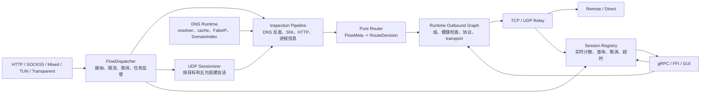

# RustBox 架构

> 文档状态：目标架构与长期不变量
>
> 最后更新：2026-07-10
>
> 当前实现差异：[`current-architecture.md`](current-architecture.md)

RustBox 采用一条直接的主调用链：

```text
CLI / FFI / Rust embedding
          |
          v
       RustBox
  new/start/stop/reload/snapshot
          |
          v
  config + proxy modules + kernel
          |
          v
        Tokio
```

## 原则

1. `apps/rustbox` 只是 CLI。它解析参数、处理终端信号并调用 `RustBox`，不自行
   编译配置或装配代理图。
2. `rustbox-ffi` 只是 ABI 翻译层。它把 C 的字节串、句柄和状态码转换为同一个
   `RustBox` 接口，不维护第二套引擎实现。
3. Tokio 是项目选定的异步运行时，可以在需要异步 I/O 的 crate 中直接使用。
   不为假设中的其他 runtime 增加 adapter、executor 或 wrapper 层。
4. 只有存在真实替换需求时才保留 trait：
   - 测试需要内存网络或可控时钟；
   - Linux、Windows、Android 等平台实现确实不同；
   - 一个协议需要接收 TCP、TLS、代理隧道等多种流。
5. crate 按可独立测试和复用的功能拆分，不按抽象层级拆分。没有独立用途的
   pass-through crate 应合并或删除。

## 目标数据面

RustBox 的目标数据面不是简单的同步调用链，而是由 `RustBox` 统一监督的一组
有界并发会话：



这张图描述目标边界，不表示所有组件已经实现。当前实现状态只在
`current-architecture.md` 中声明。

### Flow 接纳与并发所有权

inbound 只完成协议接入、认证、原始目标恢复和 `Flow` 构造。它不直接执行整条
relay，也不决定每个入口是否自行 `spawn`。

`FlowDispatcher` 是数据面并发的唯一入口，职责包括：

- 接纳 flow 后立即返回可查询、可取消的 `FlowHandle`；
- 在统一 supervisor 下启动 flow task；
- 应用全局、每 inbound 和每源地址的并发上限；
- 在过载时返回明确的拒绝或背压结果；
- 在 reload/stop 时停止接纳，并等待或取消存量会话；
- 保证一个长连接不会阻塞 listener、TUN stack 或其他 flow。

长期运行的 relay future 不应借用 inbound accept loop。任务所有权必须落在
`RustBox` 持有的 dispatcher/session runtime 中。

### TCP 数据路径

```text
accept stream
  -> construct Flow + FlowMeta
  -> dispatch under supervisor
  -> bounded inspection with replayable prefix
  -> pure route decision
  -> resolve runtime outbound/group
  -> open outbound stream
  -> instrumented bidirectional relay
  -> close, publish final outcome, remove active session
```

inspection 最多读取配置允许的前缀，并受大小和时间限制。读取过的字节必须通过
prefixed/replay stream 交回后续协议或 relay，不得丢失、重复或无限等待。

### UDP 数据路径

UDP 的入口对象与已路由会话必须分开：

- `DatagramEndpoint` 表示 SOCKS5 UDP association 等可承载多个目的地址的入口；
- `DatagramSession` 表示目标固定、已经完成 inspection 和 route 的逻辑会话；
- sessionizer 至少按 inbound、客户端和目的地址建立有界表；TUN 场景使用完整
  五元组；
- 每个新目的地址独立路由，不能使用 `UDP ASSOCIATE` 的占位地址替代真实目标；
- 会话具有 idle timeout、容量上限、确定的淘汰规则和响应回映射；
- UDP relay 保留数据报边界、目标地址和独立的 packet/byte/drop 统计。

具体 packet-to-flow 与平台约束见
[`tun-transparent-proxy-architecture.md`](tun-transparent-proxy-architecture.md)。

### Inspection 与 FlowMeta

路由前的信息补充拆成两类能力：

1. metadata-only enricher：进程、用户、inbound 标签、FakeIP/DNS 反查等，不读取
   payload；
2. payload inspector：在受限预算内查看 TCP 前缀或首个数据报，识别 TLS SNI、
   HTTP Host 和协议提示。

二者产出统一的 `FlowMeta`，router 只消费不可变的最终快照。inspection 失败必须
有显式策略：继续使用已有 metadata、拒绝 flow，或记录诊断；不得静默改变目标。

`FlowMeta` 可按真实路由需求逐步增加可选字段，例如 inbound 名称/类型、认证用户、
进程、UID、解析后的 IP 和嗅探来源。不要引入无类型的任意键值 bag 来代替稳定契约。

### DNS Runtime 与 DomainIndex

DNS 是独立运行时子系统，不进入 `rustbox-route`：

```text
DNS query -> policy -> cache/dedup -> transport -> response
                    -> FakeIP and IP-to-domain DomainIndex

transparent/TUN flow -> DomainIndex lookup -> optional payload inspection -> router
```

DNS transport 可以选择 outbound，但必须有 bootstrap 和防递归规则，避免
“解析代理服务器域名需要代理，而代理建立又需要先解析域名”的环。`DomainIndex`
条目必须带来源、过期时间和冲突策略；普通 DNS snooping 与 FakeIP 映射共享查询
接口，但不必共享存储实现。

### Runtime Outbound Graph

router 返回逻辑 outbound ID，不把 selector、URLTest 或 fallback 在配置编译期
折叠为固定 child。运行时 outbound graph 负责：

- concrete adapter：Direct、HTTP、SOCKS5、Shadowsocks、AnyTLS 等；
- group：Selector、URLTest、Fallback、LoadBalance、Relay；
- 周期和按需 health check；
- 每个 flow 的 child 选择与选择原因记录；
- group 引用的循环检测和最大递归深度；
- reload 时以新图替换新建 flow 的解析视图，存量 flow 继续持有旧图所需资源。

transport 层只在多个真实协议需要复用 TLS、WebSocket、gRPC、H2 等连接构造时扩展，
不为尚不存在的组合预建抽象。

### Session Registry 与实时观测

事件日志和活跃会话控制是两个不同职责。`SessionRegistry` 保存最小的运行状态与
取消句柄，`ObservabilitySink` 继续负责结构化事件导出。

每个活跃会话至少应暴露：

- flow/session ID、network、source、original/effective destination；
- inbound、逻辑 outbound、最终 concrete outbound；
- created/last-active 时间、当前状态和结束原因；
- 实时上下行 bytes；UDP 另有 packets 和 drops；
- cancel handle。

relay 使用低成本计数 wrapper 更新原子计数；高频数据不应逐 buffer 生成格式化日志。
控制 API 通过 registry 的只读快照查询，并通过命令接口执行取消、组切换或 reload，
不直接持有 socket 和内部可变引用。

### 资源上限与关闭语义

所有长生命周期或按流增长的结构都必须有明确上限：

- dispatcher 队列和并发 flow 数；
- inspection 的字节数、持续时间和并发数；
- UDP session 表、DNS cache、DomainIndex 和事件缓冲；
- outbound 连接池和 health-check 并发数。

`stop` 的顺序是：停止接纳新 flow，停止后台刷新/探测，取消或限时排空存量会话，
撤销平台网络配置，最后关闭控制服务和 host 资源。资源释放和平台规则回滚必须是
幂等的。

## 公共 Rust 接口

`rustbox` crate 当前承载共享应用接口：

```rust
let mut rustbox = RustBox::new(source_config)?;
rustbox.start().await?;
let snapshot = rustbox.snapshot();
rustbox.reload(next_source_config).await?;
rustbox.stop().await?;
```

需要共享进程服务时使用 `RustBoxOptions`。例如控制 gRPC 的监听配置、观测存储、
命令通道、任务和 shutdown 都由 `RustBox` 持有；CLI 只把命令行参数翻译成 option。

源码位于 `crates/rustbox`。内部运行图构造器不属于 CLI 或 FFI API。

## 配置

所有入口使用同一条路径：

```text
TOML / programmatic SourceConfig
  -> parse
  -> normalize
  -> validate
  -> compile
  -> RustBox
```

文件格式解析仍与运行配置模型分开，因为 FFI、GUI 和测试可以直接提供
`SourceConfig`。这是一条有实际调用方的边界，不是为解耦而解耦。

## Tokio 与 host trait

`TokioHost` 位于 `rustbox-host-api`，不再有独立的
`rustbox-runtime-tokio` crate。网络、时钟、随机数和任务默认由 Tokio 实现。

`NetworkProvider`、`Clock`、`PacketDeviceProvider` 等 trait 暂时保留，是因为
测试 host 和平台设备确实有多个实现。它们不是“可替换 runtime 架构”。如果
某个 trait 最终只有 Tokio 一个实现且测试也不需要替身，应继续删除。

## 生命周期

`RustBox` 是生命周期的唯一所有者：

- `new`：校验配置并准备运行图；
- `start`：启动所有 inbound 以及 option 启用的控制服务；
- `stop`：按反向顺序停止数据面服务并回收控制服务任务；
- `reload`：准备新图，并在需要时停止旧图、启动新图；
- `snapshot`：向 CLI、FFI、控制 API 返回同一种状态。

C 调用方没有 Tokio runtime，因此 FFI 只额外持有一个 Tokio `Runtime` 来
`block_on` 同一组 async 方法。这是同步 ABI 桥接，不是另一套业务实现。

## 依赖边界

需要坚持的边界很少：

- 协议模块不解析 CLI 参数；
- FFI 不暴露 Rust 引用或 trait object；
- 配置校验不在各 inbound/outbound 中重复；
- 平台路由、TUN 和透明代理操作留在对应平台实现；
- CLI 与 FFI 不直接操作内部 `Engine` 或 service 列表。
- CLI 不持有共享服务的任务句柄、命令通道或 shutdown sender。

除此之外，优先选择直接依赖和普通函数调用。

## 升级顺序

架构升级按可独立验证的阶段推进，不要求一次重写全部数据面：

1. **并发基线**：引入 dispatcher/supervisor，修正 TUN 和 transparent accept loop，
   增加两个长期 TCP flow 并发测试及 stop/reload 取消测试。
2. **UDP 语义**：区分 endpoint 与 session，实现 SOCKS5 UDP 多目标路由、五元组
   session table、idle timeout 和容量淘汰测试。
3. **inspection + DNS 闭环**：加入 replayable prefix、真实 SNI/HTTP inspector，装配
   DNS runtime、FakeIP 反查和带 TTL 的 `DomainIndex`。
4. **运行时 outbound graph**：把 Selector/URLTest 从编译期 child 选择升级为运行时
   group，随后增加 health check、Fallback 和 LoadBalance。
5. **会话控制与实时统计**：建立 `SessionRegistry`、实时 relay counter、单连接取消和
   UDP packet/drop 指标；控制 API 只查询快照或发送命令。
6. **性能门槛**：建立吞吐、连接延迟、RSS、每 TCP/UDP session 内存和分配次数基线，
   再决定缓冲池、matcher 索引、连接复用等优化。

每一阶段都必须同时更新 `current-architecture.md`。目标接口尚未落地时，不得在
当前实现文档或 capability 输出中标记为 supported。

## 数据面不变量

1. router 是纯 `FlowMeta -> RouteDecision`，不执行 DNS、进程查询、健康检查或 I/O。
2. 一个 flow 的 relay 生命周期不能阻塞任何 accept loop。
3. 每个 UDP 数据报根据其真实目的地址归属到一个有界 session，不能用 association
   占位目标替代。
4. inspection 有严格预算，读取的 payload 必须可重放。
5. selector/group 是逻辑 outbound；最终 concrete outbound 在运行时解析并可观测。
6. reload 对新旧 flow 的资源所有权明确，不让旧 flow 引用已经销毁的运行图。
7. stop、取消和平台网络回滚是有界、幂等且可测试的。
8. 所有按流或按查询增长的表都有容量、过期与淘汰策略。
