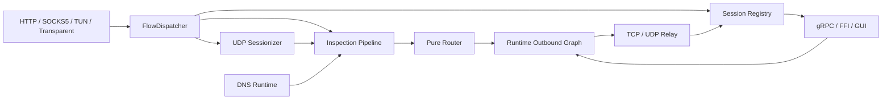

# RustBox 架构

> 目标架构与长期不变量 · 2026-07-10

```text
CLI / FFI / Rust embedding
          |
          v
       RustBox
  new / start / stop / reload / snapshot
          |
          v
  config + modules + kernel
          |
          v
        Tokio
```

## 原则

1. `apps/rustbox` 只做 CLI 参数、信号、option 翻译，不自行编译配置。
2. `rustbox-ffi` 只做 ABI 翻译，不维护第二套引擎。
3. Tokio 是唯一运行时，不为假设中的其他 runtime 加 adapter 层。
4. 只在有真实替换需求时保留 trait：测试 host、平台差异、多态流。
5. 无独立用途的 pass-through crate 应合并或删除。

## Crate 地图

| 位置 | 职责 |
|---|---|
| `apps/rustbox` | CLI |
| `crates/rustbox` | 公共 `RustBox` API、装配、进程服务生命周期 |
| `crates/rustbox-ffi` | C ABI、句柄表、Tokio 桥接 |
| `crates/rustbox-config-file` | TOML → `SourceConfig` |
| `crates/control/rustbox-config` | 校验与编译 |
| `crates/kernel/*` | flow、路由、relay、engine |
| `crates/modules/*` | inbound、outbound、DNS、TUN、transport |
| `crates/host/rustbox-host-api` | Tokio host、平台契约 |
| `crates/platform/*` | Linux / Windows TUN、路由、透明代理 |
| `crates/rustbox-observability` | 结构化事件及输出 |

已删除 `rustbox-runtime-tokio`（Tokio 现在是普通依赖）。待评估移除的 crate：`rustbox-registry`（目前主要提供模块注册与能力模型）。

## 公共 API

```rust
let mut rustbox = RustBox::new(source_config)?;
rustbox.start().await?;
let snapshot = rustbox.snapshot();
rustbox.reload(next_source_config).await?;
rustbox.stop().await?;
```

控制 gRPC、观测存储、命令通道、任务、shutdown 由 `RustBox` 持有。CLI 只翻译参数。

## 配置路径

```text
TOML / SourceConfig → parse → normalize → validate → compile → RustBox
```

文件解析与运行模型分开：FFI、GUI、测试可直接提供 `SourceConfig`。

## 生命周期

- `new` — 校验配置，准备运行图
- `start` — 启动 inbound 和可选控制服务
- `stop` — 反向停止数据面、回收控制任务、幂等回滚平台配置
- `reload` — 准备新图，替换新建 flow 视图，存量 flow 持有旧图资源
- `snapshot` — 统一状态供 CLI、FFI、控制 API

## 目标数据面



### Flow 接纳

`FlowDispatcher` 是并发唯一入口：接纳后立即返回 `FlowHandle`，在 supervisor 下启动 task，应用并发上限，过载时明确拒绝。relay future 不得阻塞 accept loop。

### TCP 路径

`accept → Flow+FlowMeta → dispatch → 有界 inspection(replayable prefix) → route → outbound → 双向 relay → close`

### UDP 路径

`DatagramEndpoint`（多目标入口）与 `DatagramSession`（已路由固定目标会话）分开。按五元组建有界 session 表，idle timeout + 容量淘汰。每个真实目标独立路由。

### Inspection

分两类：metadata enricher（进程、DNS 反查，不读 payload）和 payload inspector（受限预算内读 TLS SNI / HTTP Host）。产出不可变 `FlowMeta` 快照供 router 消费。失败策略需显式：继续、拒绝或诊断。

### DNS Runtime

独立子系统，不在 `rustbox-route` 内。bootstrap + 防递归环。`DomainIndex`（FakeIP 反查）带来源、TTL 和冲突策略。

### Runtime Outbound Graph

router 返回逻辑 outbound ID。运行时 graph 负责：concrete adapter、group（Selector/URLTest/Fallback）、health check、child 选择记录、循环检测、reload 新旧图隔离。

### Session Registry

`SessionRegistry` 保存活跃会话：ID、地址、inbound/outbound、原子 byte/packet 计数、取消句柄。控制 API 通过只读快照查询，通过命令接口取消/切换。

### 资源上限

dispatcher 队列、inspection 字节/时间、UDP session 表、DNS cache、连接池——都需明确上限。`stop` 顺序：停接纳 → 停后台探测 → 排空/取消会话 → 撤销平台配置。

## 当前实现

### 已实现

- HTTP、SOCKS5、mixed、TUN、transparent inbound
- Direct、HTTP、SOCKS5、Shadowsocks、AnyTLS outbound
- 纯函数路由表 `FlowMeta → RouteDecision`
- 配置完整 pipeline（parse/normalize/validate/compile）
- CLI + FFI 共用 `RustBox` 生命周期
- gRPC 控制 API、结构化观测、console/file/recording/store sink
- Linux/Windows TUN、Linux transparent redirect

### 待修复

- **并发边界**：TUN 和 transparent accept loop 当前直接等待 `submit`，长 flow 阻塞后续接纳
- **UDP session**：SOCKS5 UDP ASSOCIATE 多目标尚未按真实目标路由和淘汰
- **Payload inspection**：仅有静态 enricher，无真实 TLS SNI / HTTP Host 嗅探
- **DNS runtime**：有模型但未装配真实 resolver/transport
- **Outbound group**：Selector/URLTest 编译期折叠为固定 child，非运行时动态切换
- **实时统计**：relay bytes 完成后一次性发布，无活跃连接持续计数

VMess、VLESS、Trojan 仅有配置模型，组合时明确报未实现。

### AnyTLS

精确锁定 `anytls 0.2.3`（MIT），通过 sing-box 1.13.14 真实 E2E。

| 能力 | 验证 |
|---|---|
| TLS + 密码认证 | 模块测试 + sing-box E2E |
| 标准 SYN/PSH/FIN 帧、递增 stream ID、session 池 | sing-box E2E（三次连续请求） |
| TCP 代理流 | 模块回环 + E2E |
| UDP-over-TCP v2 | 模块回环 |
| TLS 证书校验、SNI、ALPN | rustls 配置路径 |

选型理由：0.2.3 保留标准流模型 + 可注入 `NetworkProvider` 拨号，不绕过 host 网络边界。0.3.x 移除了多路复用，`anytls-rs` 需 CMake/NASM，`meow-anytls` 自带 dial 会绕过 `NetworkProvider`。

配置示例：

```toml
[[outbounds]]
id = "anytls"
type = "anytls"
server = "proxy.example.com:443"
password = "replace-with-a-secret"

[outbounds.tls]
enabled = true
server_name = "proxy.example.com"

[[routes]]
type = "default"
outbound = "anytls"
```

升级门槛：保留可注入 dial API → 更新 pin → 通过 TCP/UOT 模块测试 → 通过三次请求 sing-box E2E（Linux/Windows/macOS）→ 验证无 session/连接泄漏。

## 仍保留的 trait

- `NetworkProvider`：测试 host 需内存网络
- `PacketDeviceProvider` / `NetworkControl`：Linux / Windows / 移动平台实现不同
- `ObservabilitySink`：console、file、store 有多个实现
- `ByteStream`：仅 `AsyncRead + AsyncWrite + Send + Unpin` 的可装箱组合，无自定义 poll

新增 trait 前需给出第二个真实实现。

## 依赖边界

- 协议模块不解析 CLI；FFI 不暴露 Rust 引用/trait object
- 配置校验不重复；平台操作留在平台 crate
- CLI / FFI 不直接操作内部 `Engine` 或 service 列表
- 除此之外优先直接依赖和普通函数调用

## 升级顺序

1. **并发基线** — dispatcher/supervisor，修正 TUN/transparent accept loop
2. **UDP 语义** — endpoint/session 分离，多目标路由，idle timeout 淘汰
3. **Inspection + DNS** — replayable prefix，SNI/HTTP inspector，DNS runtime + DomainIndex
4. **Runtime outbound graph** — Selector/URLTest 运行时 group，health check
5. **会话控制** — SessionRegistry，实时 counter，连接取消，UDP packet/drop 指标
6. **性能门槛** — 吞吐/延迟/RSS/分配基线，再决定优化

每阶段需同步更新本文档的"当前实现"节。

## 数据面不变量

1. router 纯函数 `FlowMeta → RouteDecision`，不做 DNS、进程查询、I/O
2. relay 生命周期不阻塞 accept loop
3. UDP 按真实目标归属有界 session
4. inspection 有严格预算，读取 payload 可重放
5. group 是逻辑 outbound，运行时解析 concrete outbound
6. reload 新旧 flow 资源隔离
7. stop、取消、平台回滚是有界、幂等、可测试的
8. 所有按流增长的表有容量、过期、淘汰策略
