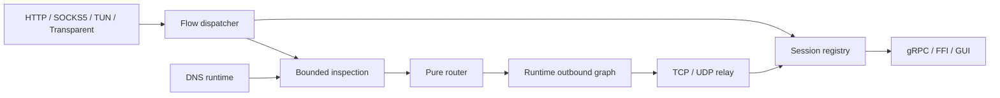

# RustBox 架构

本文只记录稳定边界、关键数据流和近期演进方向；命令与配置示例见根目录 `README.md` 和 `examples/`。

## 设计目标

RustBox 是基于 Tokio 的模块化代理引擎。CLI、FFI 和未来 GUI 共用同一个 `RustBox` 生命周期，不各自维护引擎或配置编译逻辑。

```text
CLI / FFI / embedding
        │
        ▼
     RustBox ─── new / start / reload / snapshot / stop
        │
        ├── config + control + observability
        └── kernel + modules + platform
                         │
                         ▼
                       Tokio
```

架构遵循四条规则：

1. Tokio 是唯一运行时。
2. 路由是纯计算，不执行 DNS、进程查询或网络 I/O。
3. 平台能力留在 platform/host 边界，不能渗入可移植核心。
4. trait 只用于确有多个实现的边界；无独立职责的 pass-through crate 应合并。

## 代码边界

| 层 | 位置 | 职责 |
|---|---|---|
| 应用 | `apps/rustbox` | CLI 参数、信号和输出 |
| 公共入口 | `crates/rustbox`、`rustbox-ffi` | 引擎装配、生命周期、C ABI |
| 控制与配置 | `crates/control/*`、`rustbox-config-file` | 解析、校验、编译、控制 API |
| 内核 | `crates/kernel/*` | flow、路由、relay、运行图 |
| 模块 | `crates/modules/*` | inbound、outbound、DNS、inspection、TUN stack、transport |
| 主机与平台 | `crates/host/*`、`crates/platform/*` | Tokio host、TUN、路由、透明代理 |
| 观测 | `rustbox-observability` | 事件、指标、连接快照及 sink |

允许的依赖方向是从上层装配到下层能力。协议模块不解析 CLI，FFI 不暴露 Rust 引用或 trait object，平台操作不进入 kernel/route。

## 配置与生命周期

```text
TOML → SourceConfig → normalize → validate → compile → RustBox
```

文件解析与运行模型分离，因此 FFI、GUI 和测试可直接提交 `SourceConfig`。

- `new`：校验配置并准备运行图。
- `start`：启动 inbound、后台任务和可选控制服务。
- `reload`：构建新图；新 flow 使用新图，存量 flow 继续持有旧资源。
- `snapshot`：向 CLI、FFI 和控制 API 提供统一只读状态。
- `stop`：停接纳，停后台任务，排空或取消会话，最后回滚平台配置；操作必须有界且幂等。

## 数据面



TCP 路径：`accept → dispatch → inspection → route → outbound → relay → close`。

UDP 将多目标入口 `DatagramEndpoint` 与已路由的固定目标 `DatagramSession` 分开；会话表必须有容量、空闲超时和淘汰策略。dispatcher 接纳后立即交给 supervisor，relay 不得阻塞 accept loop。

inspection 在字节和时间预算内补充不可变 `FlowMeta`。metadata enricher 可查询进程或 DNS，payload inspector 可读取并重放有限前缀以识别 TLS SNI / HTTP Host。router 只消费结果。

router 返回逻辑 outbound ID；运行时 outbound graph 负责 concrete adapter、Selector/URLTest/Fallback、健康检查、循环检测以及 reload 隔离。

## 平台边界

TUN 路径为 `PacketDevice → packet-to-flow stack → dispatcher`；透明代理路径为 `OS redirect → original-dst lookup → dispatcher`。两者共享后半段数据面，但 TUN 额外需要 packet device 和网络栈。

`PacketDeviceProvider` 提供设备 I/O，`NetworkControl` 以 lease 表示可回滚的路由、DNS、重定向和防泄漏变更。出站必须支持绕过自身捕获。Linux 和 Windows 分别在 `crates/platform/` 实现能力；不支持的能力应在 composition 阶段返回结构化诊断，不静默降级。

## 观测与控制

kernel/modules 只产生结构化事件；sink 负责 console、file、recording、store、平台日志或远程导出。慢 sink 在自身内部缓冲，不能向 relay 施加背压。

`ObservabilityStore` 提供有界事件、指标和连接快照，控制 API 负责查询及 stop 等命令。目标 `SessionRegistry` 保存会话元数据、逻辑/实际 outbound、原子 byte/packet/drop 计数和取消句柄，不暴露 socket。非 loopback 控制端点必须启用 token，凭证不得进入事件。

## 当前能力与缺口

已实现 HTTP、SOCKS5、mixed、TUN、transparent inbound；Direct、HTTP、SOCKS5、Shadowsocks、AnyTLS outbound；配置 pipeline、CLI/FFI 生命周期、gRPC 控制 API、结构化观测，以及 Linux/Windows TUN 和 Linux redirect。VMess、VLESS、Trojan 目前只有配置模型，组合时会明确报未实现。

近期工作按依赖顺序推进：

1. dispatcher/supervisor：解除 TUN 和 transparent accept loop 对长 flow 的等待。
2. UDP session：按真实目标路由，加入容量、超时和淘汰。
3. inspection + DNS：可重放前缀、SNI/Host 和独立 resolver。
4. runtime outbound graph：运行时 group、健康检查和 child 选择记录。
5. session control：活跃连接持续计数、取消和 UDP 指标。
6. 性能基线：测量吞吐、延迟、RSS 和分配后再优化。

## AnyTLS

AnyTLS outbound 固定使用协议兼容的 `anytls 0.2.3`（MIT），保留可注入 `NetworkProvider` 的拨号边界，并以 sing-box 1.13.14 做真实端到端验证。当前覆盖 TLS/密码认证、标准帧、递增 stream ID、session 池、TCP 代理及 UDP-over-TCP v2；升级必须继续通过模块测试、连续三次请求的 sing-box E2E 和资源泄漏检查。

## 不变量

1. accept loop 不等待 relay 生命周期。
2. router 保持 `FlowMeta → RouteDecision` 纯函数。
3. inspection 有严格预算且读取的 payload 可重放。
4. UDP 和所有按 flow 增长的表都有容量、过期与淘汰策略。
5. reload 隔离新旧 flow 的资源，stop/取消/平台回滚有界且幂等。
6. 逻辑 outbound 由运行时 graph 解析为实际 child。
7. 新增 trait 前必须存在第二个真实实现。
