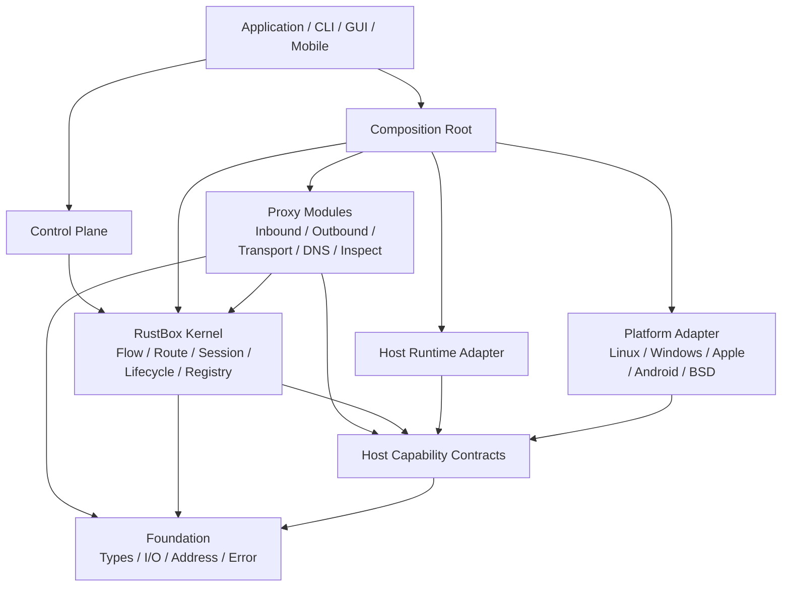
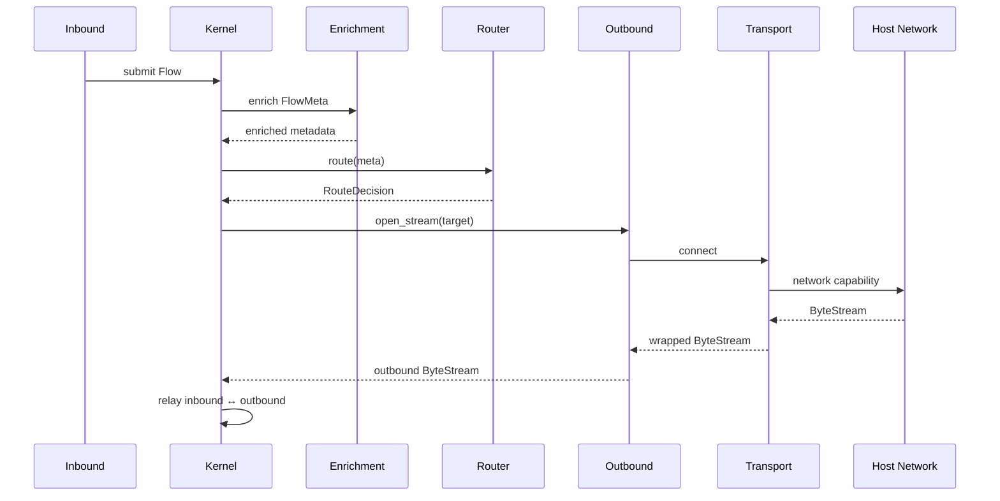

# RustBox Architecture

> **Document status:** Draft  
> **Architecture version:** 0.1  
> **Project:** RustBox  
> **Language:** Rust  
> **Document path:** `docs/architecture.md`
> **Current implementation map:** `docs/current-architecture.md`

---

## 1. Purpose

RustBox is a modular network proxy engine written in Rust.

Its primary architectural objective is not merely “cross-platform support”. RustBox must separate platform-independent proxy logic from host capabilities so thoroughly that the platform-independent portion is, in principle, capable of being compiled for a constrained target such as WebAssembly.

RustBox does **not** require a WebAssembly runtime, WebAssembly distribution, or WASI implementation.

The WebAssembly criterion is used only as an architectural litmus test:

> **If a module claims to be platform-independent, it must not require native operating-system facilities in order to compile.**

RustBox therefore follows a **portable core + capability ports + host adapters + composition root** architecture.

---

## 2. Design Goals

RustBox SHALL provide:

1. A platform-independent proxy core.
2. Replaceable operating-system integration.
3. Replaceable asynchronous runtime integration.
4. Independent inbound, outbound, transport, DNS, routing, and inspection modules.
5. Explicit dependency direction.
6. Explicit lifecycle ownership.
7. Testable modules without real sockets or real operating systems.
8. Native performance on supported host platforms.
9. A stable internal extension model.
10. A clear boundary for FFI and mobile embedding.

RustBox SHOULD make it possible to replace:

- Tokio with another executor.
- Linux socket facilities with Windows networking facilities.
- Kernel TUN integration with another packet source.
- System DNS with an internal DNS engine.
- A routing engine without rewriting proxy protocols.
- A transport without rewriting an outbound protocol.
- A native host implementation with a test host.

---

## 3. Non-Goals

RustBox is not designed around the following assumptions:

- Dynamic plugins are mandatory.
- Every internal trait must become a public stable ABI.
- Every crate must independently support WebAssembly.
- The proxy engine must expose operating-system concepts to protocol modules.
- Tokio is the architecture.
- TUN is part of the core.
- Configuration file formats define runtime architecture.
- Inbound and outbound modules directly call operating-system sockets.

Dynamic plugins, WASM modules, and external ABI stability may be introduced later. They must not distort the initial core architecture.

---

## 4. Core Architectural Rule

The fundamental dependency rule is:

```text
Application
    ↓
Composition
    ↓
Modules
    ↓
Kernel
    ↓
Contracts / Capabilities
    ↓
Foundation

Host Adapters ────────────────┘
```

A more complete view is:



### 4.1 Dependency Direction

Dependencies always point toward abstractions.

The kernel MAY depend on host capability traits.

The kernel MUST NOT depend on a host implementation.

For example:

```text
rustbox-kernel
    → rustbox-host-api

rustbox-platform-linux
    → rustbox-host-api

rustbox-platform-windows
    → rustbox-host-api
```

The following dependency is forbidden:

```text
rustbox-kernel
    → rustbox-platform-linux
```

The same rule applies to Tokio:

```text
rustbox-runtime-tokio
    → rustbox-host-api
```

The following is forbidden:

```text
rustbox-kernel
    → tokio
```

---

## 5. Layer Model

RustBox uses six architectural layers.

```text
L5  Application and Control
L4  Composition
L3  Proxy Modules
L2  Kernel
L1  Capability Contracts
L0  Foundation
```

Host implementations attach to L1 from the side.

---

## 6. L0 — Foundation

The foundation layer defines portable data types and I/O contracts.

Suggested crates:

```text
rustbox-types
rustbox-io
```

### 6.1 `rustbox-types`

Responsibilities:

- `Endpoint`
- `Host`
- `IpAddress`
- `Network`
- `TransportProtocol`
- `FlowId`
- `InboundId`
- `OutboundId`
- `SessionId`
- `FlowMeta`
- `RouteDecision`
- portable error taxonomy

Example:

```rust
pub struct FlowMeta {
    pub id: FlowId,
    pub network: Network,
    pub source: Endpoint,
    pub destination: Endpoint,
    pub inbound: InboundId,
    pub domain: Option<Host>,
    pub protocol_hint: Option<ProtocolHint>,
}
```

`FlowMeta` MUST NOT contain:

- file descriptors
- Windows handles
- Tokio socket types
- platform interface indexes with platform-specific semantics
- references to kernel routing objects

Platform information may be represented as opaque, portable metadata only when the kernel genuinely requires it.

### 6.2 `rustbox-io`

`rustbox-io` defines runtime-neutral asynchronous I/O primitives.

The preferred abstraction is poll-based and executor-independent.

Conceptually:

```rust
pub trait ByteStream {
    fn poll_read(
        self: Pin<&mut Self>,
        cx: &mut Context<'_>,
        buf: &mut [u8],
    ) -> Poll<Result<usize, IoError>>;

    fn poll_write(
        self: Pin<&mut Self>,
        cx: &mut Context<'_>,
        buf: &[u8],
    ) -> Poll<Result<usize, IoError>>;

    fn poll_flush(
        self: Pin<&mut Self>,
        cx: &mut Context<'_>,
    ) -> Poll<Result<(), IoError>>;

    fn poll_close(
        self: Pin<&mut Self>,
        cx: &mut Context<'_>,
    ) -> Poll<Result<(), IoError>>;
}
```

Datagram I/O is separate:

```rust
pub trait DatagramSocket {
    fn poll_recv_from(...);
    fn poll_send_to(...);
}
```

Packet I/O is separate again:

```rust
pub trait PacketDevice {
    fn poll_recv_packet(...);
    fn poll_send_packet(...);
}
```

RustBox SHALL NOT hide all networking behind one universal `Connection` type.

A byte stream, datagram socket, and layer-3 packet device are different abstractions and must remain different.

---

## 7. L1 — Host Capability Contracts

Suggested crate:

```text
rustbox-host-api
```

This layer describes everything the portable engine may request from its host.

It defines **capabilities**, not operating systems.

Example capability groups:

```text
NetworkProvider
Clock
Entropy
TaskSpawner
Storage
PacketDeviceProvider
NetworkControl
ProcessInspector
PlatformEvents
ObservabilitySink
```

### 7.1 Network Capability

```rust
pub trait NetworkProvider {
    type Stream: ByteStream;
    type Datagram: DatagramSocket;

    fn connect_tcp(
        &self,
        request: TcpConnect,
    ) -> impl Future<Output = Result<Self::Stream, NetError>>;

    fn bind_tcp(
        &self,
        request: TcpBind,
    ) -> impl Future<Output = Result<Box<dyn StreamListener>, NetError>>;

    fn bind_udp(
        &self,
        request: UdpBind,
    ) -> impl Future<Output = Result<Self::Datagram, NetError>>;
}
```

The core asks to connect, bind, or send.

It does not call:

```rust
tokio::net::TcpStream
std::net::TcpStream
socket2::Socket
libc::socket
WSASocketW
```

Those belong to host implementations.

### 7.2 Clock Capability

Protocols must not call the system clock directly.

```rust
pub trait Clock {
    fn now(&self) -> Instant;
    fn sleep_until(
        &self,
        deadline: Instant,
    ) -> impl Future<Output = ()>;
}
```

This allows deterministic timeout testing.

### 7.3 Entropy Capability

```rust
pub trait Entropy {
    fn fill(&self, output: &mut [u8]) -> Result<(), EntropyError>;
}
```

Protocol code must not silently bind itself to a platform random source.

### 7.4 Task Capability

Hidden task spawning creates lifecycle leaks.

RustBox therefore treats task creation as an explicit capability.

```rust
pub trait TaskSpawner {
    fn spawn(
        &self,
        name: TaskName,
        task: BoxFuture<'static, ()>,
    ) -> Result<TaskHandle, SpawnError>;
}
```

Modules SHOULD avoid spawning tasks internally unless the architecture requires an independently managed task.

Long-running tasks belong to an explicit task tree owned by the kernel.

### 7.5 Packet Device Capability

TUN is a host facility.

The kernel does not open `/dev/net/tun`, call Network Extension, create a Wintun adapter, or manage Android `VpnService`.

Instead:

```rust
pub trait PacketDeviceProvider {
    fn open(
        &self,
        config: PacketDeviceConfig,
    ) -> impl Future<Output = Result<Box<dyn PacketDevice>, PacketDeviceError>>;
}
```

Linux, Windows, Apple, and Android provide different implementations.

### 7.6 Network Control Capability

Operating-system route manipulation is isolated here.

Examples:

- adding routes
- removing routes
- policy routing
- packet marks
- interface binding
- firewall redirection
- transparent proxy integration

```rust
pub trait NetworkControl {
    fn apply(
        &self,
        transaction: NetworkTransaction,
    ) -> impl Future<Output = Result<NetworkLease, NetworkControlError>>;
}
```

`NetworkLease` owns the applied system state.

Dropping or closing the lease initiates rollback.

The core must never manually remember a list of platform cleanup commands.

---

## 8. L2 — RustBox Kernel

Suggested crates:

```text
rustbox-kernel
rustbox-route
rustbox-registry
```

The kernel is the center of RustBox.

It coordinates proxy execution but does not implement specific proxy protocols.

### 8.1 Kernel Responsibilities

The kernel owns:

- engine lifecycle
- module registry
- flow lifecycle
- session lifecycle
- route evaluation
- task tree
- cancellation
- dependency wiring references
- runtime state snapshots
- controlled reload

The kernel does not own:

- Linux networking
- Windows networking
- a specific TLS implementation
- SOCKS5 parsing
- VLESS framing
- QUIC protocol internals
- JSON or YAML parsing

### 8.2 Central Concept: Flow

The principal runtime unit is a `Flow`.

```text
Inbound
   ↓
Flow
   ↓
Metadata enrichment
   ↓
Route evaluation
   ↓
Execution plan
   ↓
Outbound
   ↓
Transport chain
```

A flow contains:

```rust
pub struct Flow {
    pub meta: FlowMeta,
    pub payload: FlowPayload,
}
```

Conceptually:

```rust
pub enum FlowPayload {
    Stream(Box<dyn ByteStream>),
    Datagram(Box<dyn DatagramSession>),
}
```

A flow represents network work entering the engine.

It is not a socket.

### 8.3 Routing

The router consumes portable metadata.

```rust
pub trait Router {
    fn route(&self, flow: &FlowMeta) -> RouteDecision;
}
```

Example:

```rust
pub enum RouteDecision {
    Forward(OutboundId),
    Reject(RejectReason),
    Hijack(ServiceId),
}
```

Routing MUST be a pure decision whenever possible.

DNS requests, process lookup, or sniffing are not hidden inside `Router::route`.

Instead, metadata enrichment occurs before route evaluation.

This keeps route evaluation deterministic and benchmarkable.

### 8.4 Metadata Enrichment Pipeline

RustBox separates observation from decision.

```text
Initial FlowMeta
      ↓
Sniffer
      ↓
DNS Correlator
      ↓
Process Metadata Provider
      ↓
Policy Metadata
      ↓
Final FlowMeta
      ↓
Router
```

Each enrichment stage declares the metadata it can provide.

The kernel decides which enrichers are enabled.

A route engine does not directly call an OS process API.

### 8.5 Lifecycle

All long-lived components implement a lifecycle contract.

```rust
pub trait Service {
    fn start(&mut self, ctx: ServiceContext<'_>)
        -> impl Future<Output = Result<(), ServiceError>>;

    fn stop(&mut self)
        -> impl Future<Output = Result<(), ServiceError>>;
}
```

Lifecycle states:

```text
Created
  ↓
Prepared
  ↓
Running
  ↓
Stopping
  ↓
Stopped
```

The kernel controls transition order.

Modules do not start themselves during construction.

Constructors must not:

- bind sockets
- spawn background tasks
- modify system routes
- open TUN devices

Constructors construct.

`start()` acquires runtime resources.

`stop()` releases runtime resources.

---

## 9. L3 — Proxy Modules

Proxy functionality is implemented as modules.

Suggested groups:

```text
modules/inbound/*
modules/outbound/*
modules/transport/*
modules/dns/*
modules/inspect/*
modules/stack/*
```

### 9.1 Inbound

An inbound converts an external source into a RustBox `Flow`.

```rust
pub trait Inbound: Service {
    fn id(&self) -> InboundId;
}
```

Examples:

```text
inbound-socks5
inbound-http
inbound-tun
inbound-transparent
```

Inbound modules send flows to the kernel through a `FlowSink`.

```rust
pub trait FlowSink {
    fn submit(
        &self,
        flow: Flow,
    ) -> impl Future<Output = Result<(), FlowError>>;
}
```

An inbound does not choose an outbound.

An inbound does not execute routing rules.

### 9.2 Outbound

An outbound executes an egress request.

```rust
pub trait Outbound {
    fn id(&self) -> OutboundId;

    fn open_stream(
        &self,
        ctx: OutboundContext<'_>,
        target: Endpoint,
    ) -> impl Future<Output = Result<Box<dyn ByteStream>, OutboundError>>;

    fn open_datagram(
        &self,
        ctx: OutboundContext<'_>,
        target: Endpoint,
    ) -> impl Future<Output = Result<Box<dyn DatagramSession>, OutboundError>>;
}
```

Examples:

```text
outbound-direct
outbound-block
outbound-socks5
outbound-shadowsocks
outbound-vless
outbound-trojan
```

### 9.3 Transport

Transport modules wrap or establish lower-level communication channels.

```rust
pub trait StreamTransport {
    fn connect(
        &self,
        ctx: TransportContext<'_>,
        target: Endpoint,
    ) -> impl Future<Output = Result<Box<dyn ByteStream>, TransportError>>;
}
```

Examples:

```text
transport-tcp
transport-tls
transport-websocket
transport-http2
transport-quic
transport-mux
```

Transports are composable.

Conceptually:

```text
VLESS
  ↓
WebSocket
  ↓
TLS
  ↓
TCP
  ↓
NetworkProvider
```

The outbound protocol defines protocol semantics.

The transport defines how bytes reach the peer.

These are separate concerns.

### 9.4 Protocol Codec Separation

Where practical, protocol parsing and framing should be separated from runtime adapters.

Example:

```text
rustbox-codec-socks5
rustbox-inbound-socks5
rustbox-outbound-socks5
```

`rustbox-codec-socks5` contains:

- request parsing
- response encoding
- authentication framing
- protocol state machine

It must not open sockets.

This separation provides three benefits:

1. Protocol fuzzing becomes trivial.
2. Codec logic remains platform-independent.
3. The same codec can be reused by inbound and outbound implementations.

The same principle applies to other protocols when their structure permits it.

### 9.5 DNS

DNS is a subsystem, not a special case inside routing.

Recommended separation:

```text
rustbox-dns-core
rustbox-dns-router
rustbox-dns-udp
rustbox-dns-tcp
rustbox-dns-tls
rustbox-dns-https
rustbox-dns-quic
```

The DNS core works on DNS messages and resolver policies.

DNS transports obtain networking through capability interfaces or RustBox outbounds.

This allows DNS traffic itself to be routed.

### 9.6 TUN and User-Space Network Stacks

TUN does not belong in the kernel.

Recommended model:

```text
PacketDeviceProvider
        ↓
inbound-tun
        ↓
NetworkStack
        ↓
Flow
        ↓
Kernel
```

`inbound-tun` reads IP packets from `PacketDevice`.

A `NetworkStack` converts packet traffic into stream or datagram flows.

```rust
pub trait NetworkStack {
    fn attach(
        &mut self,
        device: Box<dyn PacketDevice>,
        sink: Box<dyn FlowSink>,
    ) -> impl Future<Output = Result<(), StackError>>;
}
```

Possible stack implementations:

```text
stack-smoltcp
stack-external
stack-native-assisted
```

This means the entire TUN implementation can be replaced without changing:

- route engine
- outbound protocols
- DNS engine
- transport modules

---

## 10. L4 — Composition

Suggested crate:

```text
rustbox-compose
```

Composition is where abstract components become a concrete RustBox instance.

This is the only layer that should know the selected implementation graph.

Example:

```rust
let host = TokioHost::new(...);
let platform = LinuxPlatform::new(...);

let engine = EngineBuilder::new()
    .network(host.network())
    .clock(host.clock())
    .entropy(host.entropy())
    .spawner(host.spawner())
    .packet_devices(platform.packet_devices())
    .network_control(platform.network_control())
    .router(router)
    .register_inbound(socks)
    .register_inbound(tun)
    .register_outbound(direct)
    .register_outbound(proxy)
    .build()?;
```

This is dependency injection without a global service locator.

RustBox SHOULD prefer explicit construction over ambient global context.

### 10.1 No Global Runtime Singleton

The following model is forbidden:

```rust
GLOBAL_CONTEXT.get().unwrap().network.connect(...)
```

Capabilities should be passed through explicit contexts.

Example:

```rust
pub struct OutboundContext<'a> {
    pub network: &'a dyn NetworkProvider,
    pub dns: &'a dyn Resolver,
    pub clock: &'a dyn Clock,
    pub entropy: &'a dyn Entropy,
}
```

This makes module dependencies visible in type definitions and tests.

---

## 11. L5 — Application and Control Plane

Suggested crates:

```text
rustbox-app
rustbox-cli
rustbox-control
rustbox-ffi
```

### 11.1 Application

`rustbox-app` owns the concrete program lifecycle.

Responsibilities:

- load configuration
- validate configuration
- build the dependency graph
- start the engine
- handle host signals
- initiate reload
- initiate shutdown

### 11.2 Control Plane

The control plane observes or modifies engine state.

Possible frontends:

```text
CLI
HTTP API
gRPC API
desktop GUI
mobile application
embedded host
```

The kernel exposes commands and snapshots.

Example:

```rust
pub enum EngineCommand {
    Reload(CompiledConfig),
    Stop,
    ReplaceRouteTable(RouteTable),
    EnableOutbound(OutboundId),
    DisableOutbound(OutboundId),
}
```

Control protocols do not receive direct mutable references to kernel internals.

### 11.3 Configuration

Configuration has three stages:

```text
Source Configuration
       ↓
Parsed Configuration
       ↓
Validated Configuration
       ↓
Compiled Configuration
       ↓
Runtime Graph
```

JSON, YAML, TOML, GUI state, or remote APIs are input formats.

They are not runtime types.

Protocol modules should not deserialize their runtime state directly from a global JSON tree.

Recommended pattern:

```rust
pub struct Socks5InboundConfig {
    pub listen: Endpoint,
    pub authentication: AuthenticationConfig,
}
```

The configuration compiler resolves:

- identifiers
- references
- defaults
- incompatible options
- dependency cycles

The runtime receives validated typed configuration.

---

## 12. Platform Architecture

Suggested structure:

```text
platform/
├── rustbox-platform-linux
├── rustbox-platform-windows
├── rustbox-platform-apple
├── rustbox-platform-android
└── rustbox-platform-bsd
```

Platform crates implement host capabilities.

### 12.1 Linux

May contain:

- TUN/TAP creation
- netlink integration
- policy routing
- socket marks
- transparent proxy facilities
- interface monitoring
- process metadata integration

### 12.2 Windows

May contain:

- Wintun integration
- Windows Filtering Platform integration
- interface and route management
- Windows-specific process metadata
- socket policy implementation

### 12.3 Apple Platforms

May contain:

- Network Extension integration
- packet tunnel adapter
- native route/interface integration where available
- platform lifecycle bridges

macOS and iOS may share a crate internally while exposing different host composition packages.

### 12.4 Android

May contain:

- `VpnService` bridge
- protected socket integration
- JNI boundary
- Android network change events

### 12.5 BSD

May contain:

- TUN integration
- routing socket support
- PF-related integration where applicable

### 12.6 Platform Capability Matrix

A platform does not need to implement every capability.

Example:

| Capability | Linux | Windows | macOS | Android | iOS |
|---|---:|---:|---:|---:|---:|
| TCP/UDP | Yes | Yes | Yes | Yes | Yes |
| Packet device | Yes | Yes | Yes | Yes | Yes |
| Route control | Yes | Yes | Yes | Limited | Limited |
| Transparent proxy | Yes | Platform-specific | Platform-specific | No | No |
| Process lookup | Yes | Yes | Yes | Limited | Limited |

Unsupported capability is an explicit property of the host.

The kernel must not infer support from `cfg(target_os)`.

---

## 13. Runtime Architecture

Recommended initial runtime:

```text
Tokio
```

Tokio is an implementation choice, not a core architectural dependency.

Suggested crate:

```text
rustbox-runtime-tokio
```

It implements:

- task spawning
- clocks and timers
- TCP/UDP networking
- runtime-specific I/O adapters

Core crates MUST NOT expose Tokio types in public interfaces.

Forbidden public API:

```rust
fn stream(&self) -> tokio::net::TcpStream;
```

Preferred:

```rust
fn stream(&self) -> Box<dyn ByteStream>;
```

Performance-sensitive implementations MAY use generics and associated types internally to avoid unnecessary dynamic dispatch.

The architectural contract and the optimized concrete path are not required to use identical dispatch strategies.

---

## 14. Workspace Structure

Recommended initial workspace:

```text
rustbox/
├── Cargo.toml
├── docs/
│   └── architecture.md
│
├── crates/
│   ├── foundation/
│   │   ├── rustbox-types/
│   │   └── rustbox-io/
│   │
│   ├── host/
│   │   └── rustbox-host-api/
│   │
│   ├── kernel/
│   │   ├── rustbox-kernel/
│   │   ├── rustbox-route/
│   │   └── rustbox-registry/
│   │
│   ├── modules/
│   │   ├── codec/
│   │   ├── inbound/
│   │   ├── outbound/
│   │   ├── transport/
│   │   ├── dns/
│   │   ├── inspect/
│   │   └── stack/
│   │
│   ├── runtime/
│   │   └── rustbox-runtime-tokio/
│   │
│   ├── platform/
│   │   ├── rustbox-platform-linux/
│   │   ├── rustbox-platform-windows/
│   │   ├── rustbox-platform-apple/
│   │   ├── rustbox-platform-android/
│   │   └── rustbox-platform-bsd/
│   │
│   ├── control/
│   │   └── rustbox-control/
│   │
│   ├── compose/
│   │   └── rustbox-compose/
│   │
│   └── ffi/
│       └── rustbox-ffi/
│
└── apps/
    └── rustbox/
```

The initial repository SHOULD avoid creating one crate for every five hundred lines of code.

Crate boundaries are architectural boundaries.

Internal modules remain Rust modules until they require one of the following:

- independent dependency policy
- independent feature policy
- independent testing/fuzzing boundary
- independent publication
- strict platform isolation
- explicit API boundary

---

## 15. Portability Contract

RustBox defines a **Portable Core Set**.

Initial portable core set:

```text
rustbox-types
rustbox-io
rustbox-host-api
rustbox-route
rustbox-registry
rustbox-kernel
portable protocol codecs
portable protocol modules
portable DNS core
```

These crates SHOULD compile under a portability-check target.

The exact target may evolve.

The intent is to detect accidental native dependencies.

### 15.1 Forbidden Dependencies in Portable Core

Portable core crates MUST NOT directly depend on:

```text
tokio
mio
socket2
libc
nix
windows
windows-sys
objc
jni
std::net
platform TUN libraries
native routing libraries
```

Portable core code SHOULD avoid direct use of:

```text
std::fs
std::env
std::thread
SystemTime::now()
```

When the capability is required, use a host contract.

### 15.2 Theoretical WASM Criterion

A portable module passes the architectural criterion when:

1. Its business logic does not require an OS syscall.
2. Its external effects are represented as capabilities.
3. Its I/O works through RustBox portable I/O contracts.
4. It does not expose native handles in its public API.
5. It does not assume threads.
6. It does not assume a specific executor.

This does not promise that the module will be distributed as WASM.

It proves that the module is not secretly a Linux or Tokio component.

---

## 16. Data Plane Execution

### 16.1 TCP-Like Flow



### 16.2 UDP-Like Flow

UDP is session-oriented inside the proxy engine even when the underlying protocol is connectionless.

The kernel manages a `DatagramSession`.

Responsibilities include:

- session keying
- idle timeout
- route association
- NAT-like state
- upstream association
- cleanup

A UDP packet is not converted into a fake TCP stream.

---

## 17. Relay Architecture

The kernel provides generic relay primitives.

```text
relay_stream
relay_datagram
```

Protocol modules MUST NOT duplicate generic bidirectional copy loops unless protocol framing requires custom behavior.

A stream relay owns:

- cancellation
- half-close semantics
- byte accounting
- idle timeout
- error normalization
- tracing identifiers

Protocol-specific transformations should be represented as stream wrappers where practical.

---

## 18. Module Registry

RustBox uses registries to build runtime graphs.

Example categories:

```text
InboundFactory
OutboundFactory
TransportFactory
DnsTransportFactory
InspectorFactory
StackFactory
```

A factory converts validated module configuration into a runtime component.

Conceptually:

```rust
pub trait OutboundFactory {
    fn kind(&self) -> &'static str;

    fn build(
        &self,
        ctx: BuildContext<'_>,
        config: &ModuleConfig,
    ) -> Result<Box<dyn Outbound>, BuildError>;
}
```

The registry is not a service locator for runtime operations.

It exists for construction and module discovery.

---

## 19. Plugin Strategy

RustBox v0.x should treat **workspace modules** as the primary extension mechanism.

Initial priority:

```text
static Rust modules
    >
feature-selected modules
    >
external process modules
    >
native dynamic libraries
```

Native Rust dynamic plugins are deliberately not the primary architecture because Rust does not provide a stable Rust ABI.

If a future native plugin ABI is introduced, it should use:

- a versioned C ABI, or
- an IPC protocol.

The internal Rust traits SHALL NOT automatically become the external plugin ABI.

### 19.1 Future Plugin Boundary

A plugin manifest may eventually declare:

```text
plugin id
ABI version
module kinds
required capabilities
configuration schema
```

Capabilities provide a natural permission model.

A plugin should receive only the host functions it requires.

---

## 20. FFI Boundary

Suggested crate:

```text
rustbox-ffi
```

FFI exists outside the kernel.

The FFI layer exposes a coarse engine API:

```text
create engine
validate configuration
start
reload
query state
stop
destroy
```

FFI MUST NOT expose:

- Rust trait objects
- Tokio types
- Rust references
- Rust enums without explicit representation
- internal module pointers

Recommended handle model:

```c
typedef uint64_t rustbox_engine_handle;
```

The FFI layer maintains a handle table and translates errors into versioned error codes plus UTF-8 diagnostic messages.

Mobile bindings are built on top of this boundary.

---

## 21. Observability

The core emits structured events.

It does not decide whether output goes to:

- terminal
- file
- Android logcat
- Apple unified logging
- Windows ETW
- remote telemetry

Conceptually:

```rust
pub struct Event {
    pub level: Level,
    pub target: EventTarget,
    pub flow_id: Option<FlowId>,
    pub kind: EventKind,
}
```

Metrics and diagnostic events should be separated.

High-frequency data-plane accounting should avoid synchronous logging.

---

## 22. Error Architecture

Errors are separated by layer.

Examples:

```text
IoError
NetError
CapabilityError
ProtocolError
RouteError
OutboundError
ServiceError
EngineError
ConfigError
PlatformError
```

Modules translate lower-level errors when crossing an architectural boundary.

The kernel should not need to pattern-match a Windows socket error code.

Platform-specific diagnostics may be retained as an opaque source for logging.

---

## 23. Reload Architecture

RustBox reload uses a compile-and-swap model.

```text
New source config
      ↓
Parse
      ↓
Validate
      ↓
Compile runtime plan
      ↓
Diff active graph
      ↓
Prepare new components
      ↓
Commit
      ↓
Drain old components
```

A configuration reload must not mutate the live engine incrementally while validation is still in progress.

Recommended transaction phases:

```text
Prepare
Commit
Drain
Rollback
```

Route tables should generally support atomic replacement.

Long-lived connections may continue using the execution plan selected when they were created.

New flows use the new graph.

---

## 24. Testing Architecture

The architecture must allow the kernel to run without a real operating system network.

Suggested test host:

```text
rustbox-test-host
```

It implements:

- virtual clock
- deterministic entropy
- in-memory byte streams
- in-memory datagrams
- fake DNS
- fake packet devices
- fake process metadata
- task scheduler hooks

Example test:

```text
virtual SOCKS inbound
        ↓
kernel
        ↓
route rule
        ↓
fake outbound
        ↓
assert target and bytes
```

### 24.1 Test Levels

```text
Unit
  protocol codec and route logic

Component
  module with fake capabilities

Kernel integration
  full flow graph with test host

Interop
  RustBox against real protocol implementations

Platform
  TUN, routes, transparent proxy, network events

Benchmark
  codec, route engine, relay, session table
```

Protocol codec crates SHOULD be fuzz targets.

Routing SHOULD support deterministic golden tests.

---

## 25. Architectural Invariants

The following rules are mandatory.

### RBX-ARCH-001

Portable core crates do not import operating-system implementation crates.

### RBX-ARCH-002

Portable core crates do not expose native handles.

### RBX-ARCH-003

Portable core public APIs do not expose Tokio types.

### RBX-ARCH-004

Inbound modules create flows; they do not choose outbounds.

### RBX-ARCH-005

Routing consumes metadata and returns a decision.

### RBX-ARCH-006

Operating-system metadata acquisition is an enrichment capability, not router logic.

### RBX-ARCH-007

TUN device creation belongs to a platform capability.

### RBX-ARCH-008

A user-space network stack is replaceable.

### RBX-ARCH-009

Constructors do not acquire long-lived operating-system resources.

### RBX-ARCH-010

All background tasks have an explicit lifecycle owner.

### RBX-ARCH-011

Configuration parsing is outside protocol runtime logic.

### RBX-ARCH-012

External FFI ABI is separate from internal Rust traits.

### RBX-ARCH-013

Dynamic plugin ABI is not identical to the Rust module API.

### RBX-ARCH-014

Stream, datagram, and packet I/O remain distinct abstractions.

### RBX-ARCH-015

Platform support is expressed through capabilities, not scattered `cfg(target_os)` branches in the kernel.

---

## 26. Initial Implementation Order

The recommended implementation order is:

### Phase 1 — Foundation

Implement:

```text
rustbox-types
rustbox-io
rustbox-host-api
rustbox-test-host
```

Goal:

Prove portable interfaces before implementing a real proxy.

### Phase 2 — Kernel

Implement:

```text
rustbox-kernel
rustbox-route
rustbox-registry
```

Support:

```text
Flow
FlowSink
Router
Outbound
Service lifecycle
stream relay
cancellation
```

### Phase 3 — Native Host

Implement:

```text
rustbox-runtime-tokio
```

Provide:

```text
TCP
UDP
clock
task spawning
entropy
```

### Phase 4 — Minimum Proxy Graph

Implement:

```text
inbound-socks5
outbound-direct
```

Target graph:

```text
SOCKS5 → Kernel → Router → Direct
```

This is the first complete RustBox.

### Phase 5 — Transport Composition

Implement:

```text
transport-tcp
transport-tls
```

Then one encrypted proxy outbound.

### Phase 6 — DNS

Implement the DNS core, DNS routing, and initial transports.

### Phase 7 — TUN

Implement:

```text
PacketDeviceProvider
platform TUN backend
inbound-tun
one NetworkStack implementation
```

The kernel must require no architectural change during this phase.

If adding TUN requires modifying core route or outbound abstractions, the earlier architecture is incomplete.

### Phase 8 — Platform Expansion

Implement Windows, Apple, Android, and BSD adapters.

---

## 27. Architecture Review Criterion

Every new module must answer five questions:

1. **What portable data does it consume?**
2. **What portable data does it produce?**
3. **Which host capabilities does it require?**
4. **Who owns its lifecycle and tasks?**
5. **Could its core logic compile without native OS APIs?**

A module that cannot answer these questions does not have a stable architectural boundary.

---

## 28. Final Architecture Summary

RustBox is organized around four fundamental concepts:

```text
Flow
Capability
Module
Kernel
```

A **Flow** is network work.

A **Capability** is an effect supplied by the host.

A **Module** transforms, creates, observes, or executes flows.

The **Kernel** owns lifecycle, routing, sessions, and execution coordination.

The operating system is not the bottom half of RustBox Core.

The operating system is one possible host that implements RustBox capabilities.

Therefore the intended architecture is:

```text
                 RustBox Application
                         │
                  Composition Root
                         │
          ┌──────────────┼──────────────┐
          │              │              │
       Inbounds        Kernel        Outbounds
          │              │              │
          └──────── Flow / Route ────────┘
                         │
                    Transports
                         │
                Host Capability API
                         │
          ┌──────────────┼──────────────┐
          │              │              │
       Runtime         Platform       Test Host
       Adapter         Adapter
          │              │
        Tokio      Linux/Windows/Apple/...
```

The architectural test is simple:

> Remove the platform crates and runtime implementation crates.

The RustBox core should still exist as a coherent, compilable proxy engine model with replaceable effects.

That is the definition of platform independence used by RustBox.
