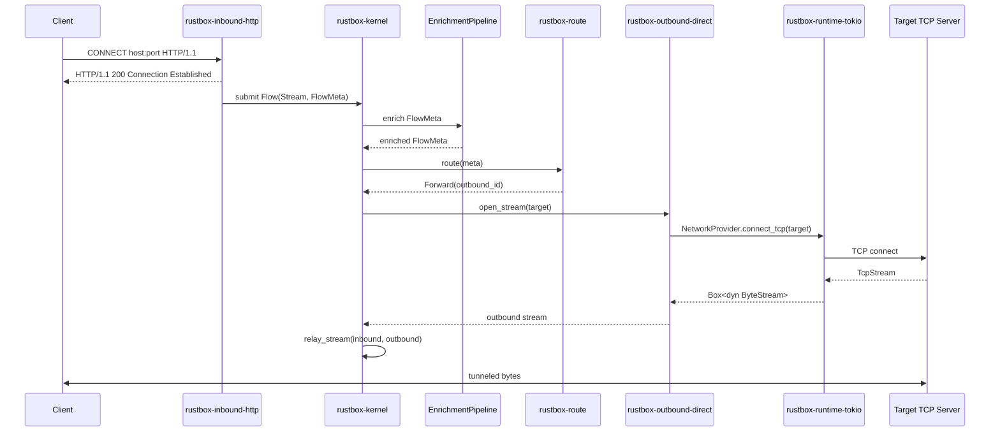
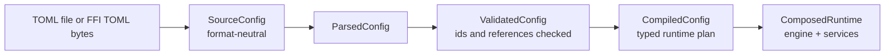
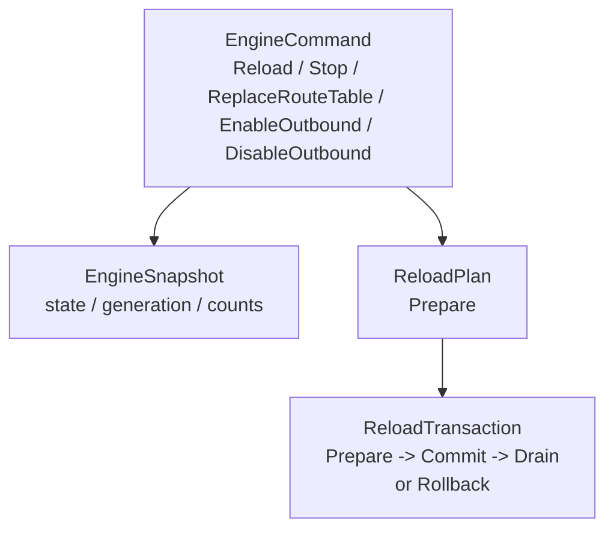
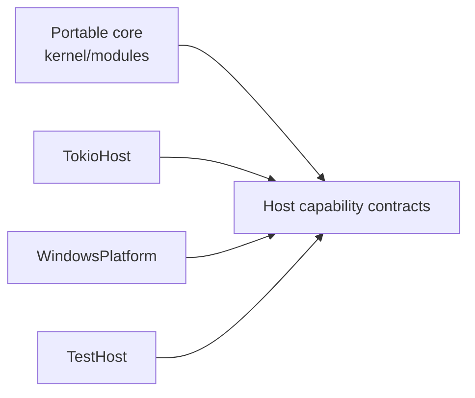
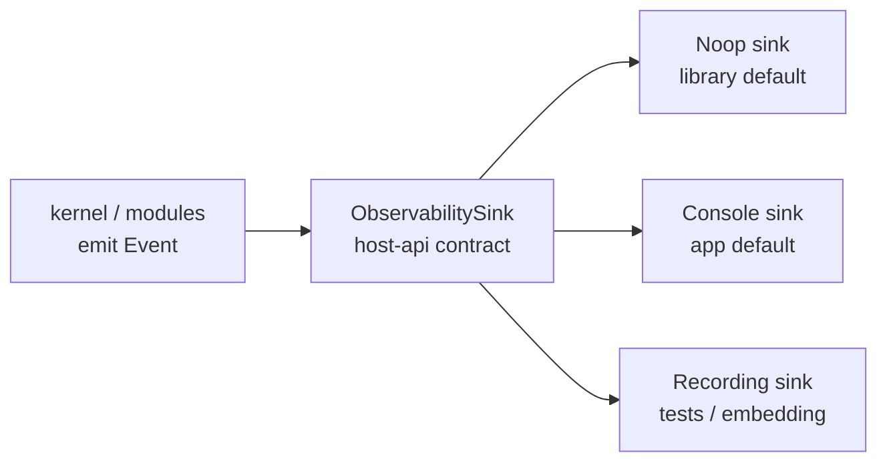
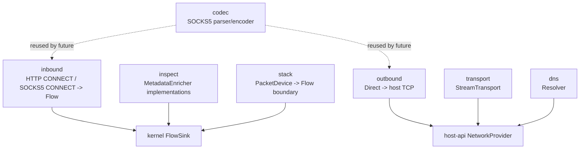
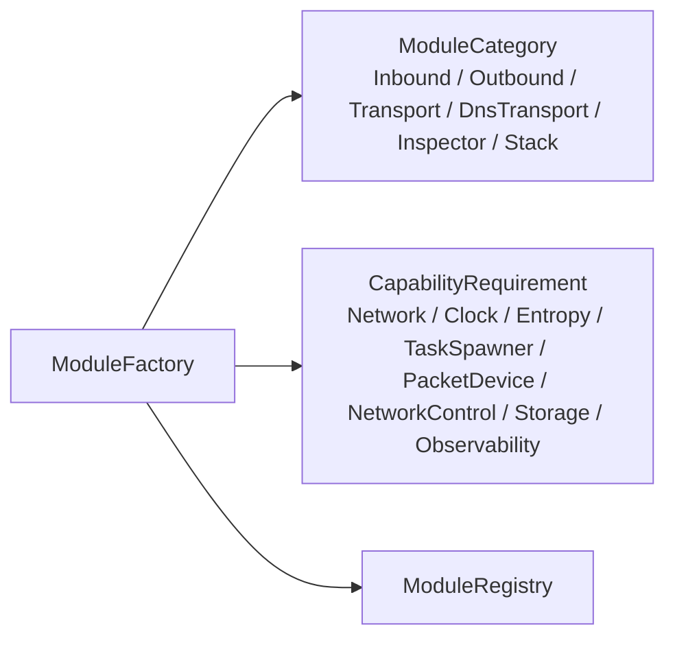
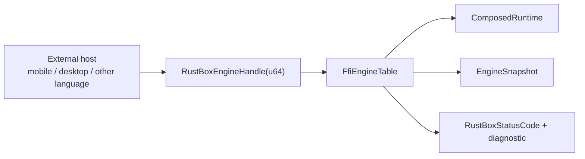

# RustBox Current Architecture

> **Document status:** Current implementation map  
> **Last updated:** 2026-07-06  
> **Scope:** Code currently present in this repository  
> **Reference architecture:** `docs/architecture.md`
> **Configuration and FFI design:** `docs/config-ffi-architecture.md`

This document describes the architecture that exists in code today. It is not a replacement for the target architecture document. It maps the current Rust workspace to the intended RustBox layers and shows the implemented boundaries, planned adapters, and verified dependency direction.

---

## 1. Current Summary

RustBox currently implements a portable proxy core with working minimum proxy
graphs:

```text
HTTP CONNECT inbound
or SOCKS5 CONNECT inbound
        ↓
Kernel flow submission
        ↓
Metadata enrichment pipeline
        ↓
Route table / router
        ↓
Direct outbound
        ↓
Tokio host network capability
        ↓
Windows/default OS TCP stack
```

The same graph now emits structured observability events at service,
connection, flow, route, outbound, completion, and failure boundaries.

The core architectural constraint is currently preserved:

```text
rustbox-kernel
  -> rustbox-host-api
  -> rustbox-io
  -> rustbox-route
  -> rustbox-types
```

The kernel does not depend on Tokio, Windows, HTTP inbound, direct outbound, FFI, composition, or application crates.

---

## 2. Workspace Map

```text
apps/
  rustbox/                         L5 application entrypoint

crates/
  compose/rustbox-compose/         L4 composition root

  config/rustbox-config-file/      TOML file adapter to SourceConfig

  control/rustbox-config/          L5 configuration pipeline
  control/rustbox-control/         L5 control commands and snapshots

  ffi/rustbox-ffi/                 External handle boundary

  foundation/rustbox-types/        L0 portable data types
  foundation/rustbox-io/           L0 runtime-neutral IO traits

  host/rustbox-host-api/           L1 host capability contracts
  host/rustbox-test-host/          Deterministic test host

  kernel/rustbox-kernel/           L2 flow, lifecycle, relay, engine
  kernel/rustbox-route/            L2 route decisions and route table
  kernel/rustbox-registry/         L2 construction-time registries

  modules/codec/rustbox-codec-socks5/       Portable SOCKS5 codec
  modules/dns/rustbox-dns-core/             Portable DNS resolver contracts
  modules/inbound/rustbox-inbound-http/     HTTP CONNECT inbound
  modules/inbound/rustbox-inbound-socks5/   SOCKS5 CONNECT inbound
  modules/inspect/rustbox-inspect/          Metadata enrichers
  modules/outbound/rustbox-outbound-direct/ Direct outbound
  modules/stack/rustbox-stack/              Packet-to-flow stack boundary
  modules/transport/rustbox-transport/      Transport contracts

  observability/rustbox-observability/      Console and recording event sinks

  platform/rustbox-platform-windows/        Windows platform capability boundary
  plugin/rustbox-plugin/                    Future plugin manifest model
  reload/rustbox-reload/                    Reload transaction model
  runtime/rustbox-runtime-tokio/            Tokio host adapter
```

---

## 3. Layer Diagram

```mermaid
flowchart TB
    APP["L5 rustbox-app\nCLI / process lifecycle"]
    CONTROL["L5 rustbox-control\ncommands / snapshots"]
    CONFIG["L5 rustbox-config\nsource -> parsed -> validated -> compiled"]
    CONFIGFILE["L5 rustbox-config-file\nTOML -> SourceConfig"]
    FFI["L5 rustbox-ffi\nopaque handle table"]

    COMPOSE["L4 rustbox-compose\ncomposition root"]

    HTTP["L3 rustbox-inbound-http\nHTTP CONNECT inbound"]
    SOCKS["L3 rustbox-inbound-socks5\nSOCKS5 CONNECT inbound"]
    DIRECT["L3 rustbox-outbound-direct\ndirect outbound"]
    TRANSPORT["L3 rustbox-transport\nstream transport contracts"]
    DNS["L3 rustbox-dns-core\nresolver contracts"]
    INSPECT["L3 rustbox-inspect\nmetadata enrichers"]
    CODEC["L3 rustbox-codec-socks5\nportable codec"]
    STACK["L3 rustbox-stack\npacket-to-flow stack boundary"]

    KERNEL["L2 rustbox-kernel\nflow / relay / lifecycle / enrichment"]
    ROUTE["L2 rustbox-route\nrouter / route table"]
    REGISTRY["L2 rustbox-registry\nmodule factory registry"]

    HOSTAPI["L1 rustbox-host-api\ncapabilities"]

    IO["L0 rustbox-io\nByteStream / DatagramSocket / PacketDevice"]
    TYPES["L0 rustbox-types\nEndpoint / FlowMeta / IDs"]

    TOKIO["Runtime adapter\nrustbox-runtime-tokio"]
    TESTHOST["Test adapter\nrustbox-test-host"]
    WINDOWS["Platform adapter\nrustbox-platform-windows"]
    OBS["Observability adapter\nrustbox-observability"]

    APP --> COMPOSE
    APP --> OBS
    APP --> CONFIGFILE
    APP --> CONFIG
    CONTROL --> CONFIG
    FFI --> COMPOSE
    FFI --> CONFIGFILE
    FFI --> CONFIG
    FFI --> CONTROL

    COMPOSE --> HTTP
    COMPOSE --> SOCKS
    COMPOSE --> DIRECT
    COMPOSE --> KERNEL
    COMPOSE --> ROUTE
    COMPOSE --> HOSTAPI
    COMPOSE --> TOKIO

    HTTP --> KERNEL
    HTTP --> HOSTAPI
    HTTP --> IO
    HTTP --> TYPES
    SOCKS --> KERNEL
    SOCKS --> HOSTAPI
    SOCKS --> IO
    SOCKS --> TYPES
    SOCKS --> CODEC

    DIRECT --> KERNEL
    DIRECT --> HOSTAPI
    DIRECT --> IO
    DIRECT --> TYPES

    TRANSPORT --> HOSTAPI
    TRANSPORT --> IO
    TRANSPORT --> TYPES
    DNS --> HOSTAPI
    DNS --> TYPES
    INSPECT --> KERNEL
    INSPECT --> TYPES
    CODEC --> TYPES
    STACK --> KERNEL
    STACK --> IO

    KERNEL --> HOSTAPI
    KERNEL --> IO
    KERNEL --> ROUTE
    KERNEL --> TYPES
    ROUTE --> TYPES
    REGISTRY --> HOSTAPI

    HOSTAPI --> IO
    HOSTAPI --> TYPES
    IO --> TYPES

    TOKIO --> HOSTAPI
    TOKIO --> IO
    TOKIO --> TYPES
    TESTHOST --> HOSTAPI
    TESTHOST --> IO
    TESTHOST --> TYPES
    WINDOWS --> HOSTAPI
    WINDOWS --> IO
    OBS --> HOSTAPI
```



---

## 4. Current Data Plane

The implemented end-to-end data paths are HTTP CONNECT and SOCKS5 CONNECT
tunnels over TCP.



Verified by:

```text
rustbox-inbound-http::tests::http_connect_tunnels_bytes_to_direct_outbound
rustbox-inbound-socks5::tests::socks5_connect_tunnels_bytes_to_direct_outbound
```

Those tests start a local TCP echo server, connect through the proxy, send
`ping`, and receive `pong`.

---

## 5. Configuration And Composition

Configuration is implemented as a staged pipeline:



Current default source:

```text
Inbound:  http CONNECT on 127.0.0.1:18080, or SOCKS5 on 127.0.0.1:1080
Outbound: direct
Route:    default -> direct
Runtime:  TokioHost
```

Current config-file source:

```text
schema_version = 1
[[inbounds]] type = "http-connect" or "socks5"
[[outbounds]] type = "direct"
[[routes]] type = "default"
```

The application does not manually wire module internals. It calls:

```text
TokioComposition::default_http_proxy_with_observability(
    Endpoint::localhost_v4(18080),
    ConsoleObservabilitySink::stderr_from_env(),
)
```

---

## 6. Control And Reload

The control plane currently defines commands and snapshots without exposing mutable kernel internals.



Reload is modeled as compile-and-swap. The live engine is not mutated while a new config is still being validated.

---

## 7. Capability Boundaries

Host effects are represented by traits in `rustbox-host-api`.



Current capabilities:

| Capability | Contract | Current implementation |
|---|---|---|
| TCP connect/bind | `NetworkProvider` | `TokioHost` |
| UDP bind | `NetworkProvider` | `TokioHost` |
| Clock | `Clock` | `TokioHost`, `TestHost` |
| Entropy | `Entropy` | `TokioHost`, `TestHost` |
| Task spawning | `TaskSpawner` | `TokioHost` |
| Packet device | `PacketDeviceProvider` | Windows boundary returns explicit planned error |
| Network control | `NetworkControl` | Windows boundary returns explicit planned error |
| Observability | `ObservabilitySink` | `NoopObservabilitySink`, `ConsoleObservabilitySink`, `RecordingObservabilitySink` |

### 7.1 Observability Layer

Runtime logging is modeled as a capability, not as direct calls to a concrete
logging framework from the portable core.



Current event coverage:

| Boundary | Current events |
|---|---|
| HTTP inbound service | service starting, started, stopping, stopped |
| HTTP inbound accept path | connection accepted, malformed CONNECT diagnostic |
| SOCKS5 inbound service | service starting, started, stopping, stopped |
| SOCKS5 inbound accept path | connection accepted, malformed greeting/request diagnostic |
| Kernel flow path | flow accepted, route selected, flow completed, flow failed |
| Direct outbound | outbound connecting, connected, failed |

The `rustbox-app` binary uses `ConsoleObservabilitySink::stderr_from_env()`.
`RUSTBOX_LOG` accepts `trace`, `debug`, `info`, `warn`, `error`, or `off`.
Library composition defaults to `NoopObservabilitySink` unless the caller
injects an observability sink.

---

## 8. Module Boundaries

Current module groups:



Important current status:

| Area | Status |
|---|---|
| HTTP CONNECT inbound | Implemented |
| SOCKS5 CONNECT inbound | Implemented |
| Direct TCP outbound | Implemented |
| Generic stream relay | Implemented |
| Structured observability events | Implemented |
| Console log adapter | Implemented |
| SOCKS5 codec | Portable parser/encoder implemented |
| SOCKS5 outbound module | Not implemented yet |
| SOCKS5 BIND / UDP ASSOCIATE / username-password auth | Not implemented yet |
| DNS resolver contract | Implemented |
| DNS UDP/TCP/DoH/DoQ transports | Not implemented yet |
| Packet-to-flow stack | Boundary implemented, concrete stack planned |
| TUN inbound | Not implemented yet |

---

## 9. Registry And Plugin Model

Construction-time module discovery is represented by `rustbox-registry`.



The future plugin boundary is metadata-only today:

```text
PluginManifest
  - plugin id
  - ABI version
  - declared modules
  - required capabilities
  - optional configuration schema
```

Internal Rust traits are not treated as the external plugin ABI.

---

## 10. FFI Boundary

FFI is modeled as an opaque handle table.



The FFI boundary does not expose:

- Rust references
- Rust trait objects
- Tokio types
- internal module pointers

Current FFI configuration entrypoints:

```text
rustbox_validate_config_toml
rustbox_engine_create_from_config_toml
rustbox_engine_reload_config_toml
```

These parse UTF-8 TOML bytes into `SourceConfig` on the Rust side. Existing
default HTTP CONNECT and SOCKS5 convenience functions remain available.

---

## 11. Platform Status

Current platform implementation:

```text
rustbox-platform-windows
```

This crate currently declares the Windows capability boundary and returns explicit planned errors for capabilities that are not implemented yet.

| Windows capability | Current status |
|---|---|
| TCP/UDP through runtime | Supported by `TokioHost` |
| Packet device | Planned |
| Route control | Planned |
| Transparent proxy | Planned |
| Process lookup | Planned |

The kernel does not infer platform support from `cfg(target_os)`.

---

## 12. Current Verification

The current architecture is verified with:

```text
cargo fmt --all --check
cargo test --workspace
cargo clippy --workspace --all-targets -- -D warnings
cargo tree -p rustbox-kernel
cargo run -p rustbox-app
```

Key tests:

| Test | Purpose |
|---|---|
| `http_connect_tunnels_bytes_to_direct_outbound` | Full HTTP CONNECT -> kernel -> direct outbound tunnel |
| `socks5_connect_tunnels_bytes_to_direct_outbound` | Full SOCKS5 CONNECT -> kernel -> direct outbound tunnel |
| `forwards_stream_flow_to_selected_outbound` | Kernel route and outbound dispatch |
| `compiles_default_http_proxy_to_typed_runtime_plan` | Config pipeline |
| `compiles_default_socks5_proxy_to_typed_runtime_plan` | SOCKS5 config pipeline |
| `rustbox-config-file::tests::parses_http_and_socks5_proxy_config` | TOML file adapter |
| `validates_toml_config_through_c_abi` | FFI TOML validation path |
| `reload_transaction_enforces_prepare_commit_drain_order` | Reload transaction order |
| `manifest_declares_modules_without_exposing_rust_traits` | Plugin ABI separation |
| `parses_domain_connect_request_without_runtime_dependencies` | Portable SOCKS5 codec |

---

## 13. Current Invariants

The current implementation satisfies these architecture invariants:

| Invariant | Current status |
|---|---|
| Portable core does not depend on Tokio | Satisfied |
| Portable core does not depend on platform adapters | Satisfied |
| Tokio types are not exposed by kernel APIs | Satisfied |
| Inbound creates flows and does not choose outbound | Satisfied |
| Router consumes metadata and returns decisions | Satisfied |
| Metadata enrichment is outside router logic | Satisfied |
| TUN creation is outside kernel | Satisfied |
| Stream, datagram, and packet abstractions are distinct | Satisfied |
| Configuration formats are outside runtime modules | Satisfied |
| Config file parsing is outside kernel and protocol modules | Satisfied |
| FFI is separate from internal Rust traits | Satisfied |
| Plugin ABI is not internal Rust trait API | Satisfied |
| Concrete logging output is outside portable core | Satisfied |

---

## 14. Not Yet Implemented

The following are intentionally not complete yet:

- SOCKS5 outbound runtime module.
- SOCKS5 BIND, UDP ASSOCIATE, and username-password authentication.
- DNS UDP/TCP/TLS/HTTPS/QUIC transports.
- Concrete TUN inbound.
- Concrete packet-to-flow network stack.
- Windows Wintun / WFP / route-control implementation.
- Linux, Apple, Android, and BSD platform adapters.
- General FFI config-handle API for arbitrary user configuration.
- Full controlled live reload integration into the running app.
- File, tracing, ETW, Android logcat, Apple unified logging, and remote telemetry sinks.

These are now extension points, not missing architecture seams in the kernel.
