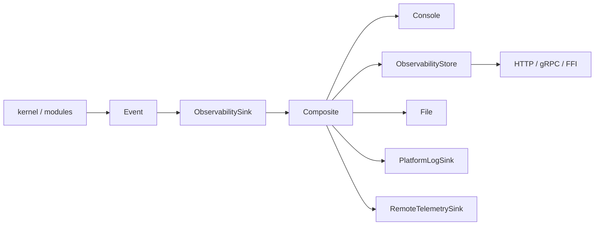

# RustBox Observability

> 2026-07-10 · 见 `architecture.md`

核心规则：kernel 只 emit event → adapter 记录/导出 → 控制 API 查询快照。kernel 不感知最终消费端。

## 当前实现

| 组件 | 位置 | 用途 |
|---|---|---|
| Event 契约 | `ObservabilitySink`, `Event`, `EventKind` | 可移植边界 |
| Console sink | `ConsoleObservabilitySink` | CLI 输出，`RUSTBOX_LOG` 过滤 |
| Recording sink | `RecordingObservabilitySink` | 测试断言 |
| Composite sink | `CompositeObservabilitySink` | 多 sink 扇出 |
| Store | `ObservabilityStore` | metrics、连接统计、事件查询 |
| File sink | `FileObservabilitySink` | 追加结构化文本 |
| Platform bridge | `PlatformLogSink` + `PlatformLogBackend` | ETW/logcat/os_log 适配点 |
| Remote bridge | `RemoteTelemetrySink` + `TelemetryExporter` | OTLP/HTTP/gRPC 适配点 |
| gRPC API | `rustbox-control-api` | 快照、事件查询、stop 命令 |

TOML 配置：

```toml
[observability]
level = "info"
file = "target/rustbox.log"
```

## 事件流



## Metrics & 连接统计

当前指标：服务启停、连接接纳、flow 生命周期、路由决策、出站连接成败、relay byte 总计、诊断计数。

连接统计按 `FlowId` 索引：source、destination、network、state (active/completed/failed)、双向 bytes、outcome。

**已知差距**：活跃长连接无持续更新 byte counter。目标方案：低成本 counted stream wrapper + `SessionRegistry`，不逐 buffer 生成格式化日志。

目标 `SessionRegistry` 每会话保存：ID、元数据快照、逻辑/concrete outbound、原子 byte/packet/drop 计数、取消句柄。有界、显式保留策略、不暴露 socket。

## 查询 API

```
ObservabilityStore::metrics()     → MetricsSnapshot
ObservabilityStore::connections() → Vec<ConnectionStats>
ObservabilityStore::snapshot()    → ObservabilitySnapshot
ObservabilityStore::query_events(level, target, flow_id, limit) → Vec<Event>
```

gRPC 映射：`GetMetrics`、`ListConnections`、`QueryEvents`、`GetObservabilitySnapshot`、`GetEngineSnapshot`、`Stop`。

## Sink 策略

| Sink | 状态 | 规则 |
|---|---|---|
| No-op | 已实现 | 库默认 |
| Console | 已实现 | CLI 默认 |
| Recording | 已实现 | 测试/嵌入 |
| Store | 已实现 | API 数据源 |
| File | 已实现 | 主机文件追加 |
| Platform native | 适配器已实现 | 具体后端在 platform/product crate |
| Remote telemetry | 适配器已实现 | 具体导出器在 integration crate |
| gRPC API | 已实现 | 原生 RustBox 服务 |

慢/远程 sink 应在自身适配器内缓冲，不在 relay 路径引入背压。

## 安全

- 默认 bind loopback；非 loopback 需 secret/token
- 凭证不得出现在远程遥测事件中
- 事件历史和查询结果有界
- 昂贵查询限速
- 远程遥测失败视为观测失败，不影响数据面
