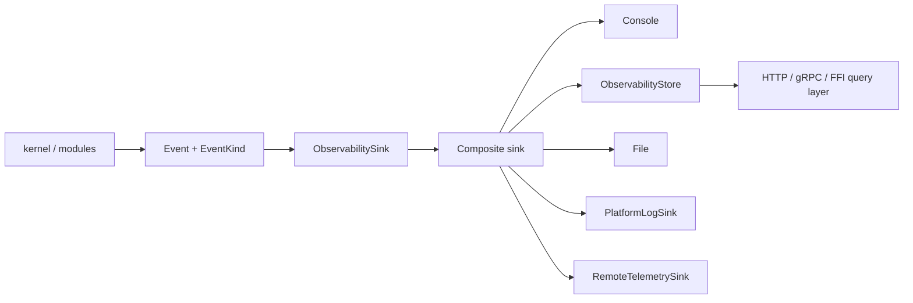
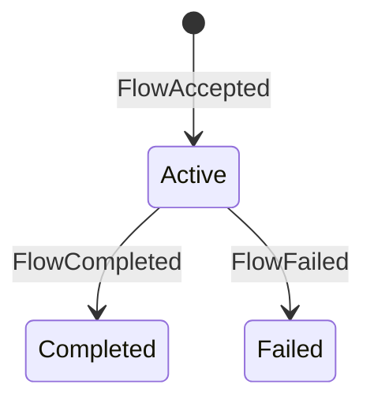

# RustBox Observability Architecture

> **Document status:** Current implementation and target direction
> **Last updated:** 2026-07-10
> **Related documents:** `docs/architecture.md`, `docs/current-architecture.md`, `docs/config-ffi-architecture.md`

This document defines how RustBox records, exposes, and exports runtime
observability without coupling the portable proxy core to a concrete logging,
metrics, API, or telemetry backend.

---

## 1. Goals

RustBox observability must support:

1. Structured events from the kernel and modules.
2. Low-cost counters for services, flows, routes, outbounds, diagnostics, and
   traffic bytes.
3. Per-flow connection statistics for API, GUI, FFI, and tests.
4. Bounded event queries for local control APIs.
5. Console, recording, file, platform-native, and remote telemetry sinks.
6. Future HTTP/gRPC control APIs without making gRPC part of the kernel.

The key rule is:

```text
core emits events -> observability adapter records/exports -> control API queries snapshots
```

The kernel does not know whether the final consumer is stderr, a file, ETW,
Android logcat, Apple unified logging, OpenTelemetry, a local HTTP endpoint, or
a gRPC control plane.

---

## 2. Current Implementation

The current code implements the following pieces:

| Piece | Location | Purpose |
|---|---|---|
| Event contract | `rustbox-host-api::Event`, `EventKind`, `ObservabilitySink` | Portable capability boundary |
| Console sink | `ConsoleObservabilitySink` | CLI stderr/stdout output with `RUSTBOX_LOG` filtering |
| Recording sink | `RecordingObservabilitySink` | Tests and embedding assertions |
| Composite sink | `CompositeObservabilitySink` | Fan-out to multiple sinks |
| Queryable store | `ObservabilityStore` | Metrics, connection stats, bounded event API |
| File sink | `FileObservabilitySink` | Append structured text events to a host file |
| Platform bridge | `PlatformLogSink` + `PlatformLogBackend` | Adapter point for ETW/logcat/os_log/syslog-like backends |
| Remote bridge | `RemoteTelemetrySink` + `TelemetryExporter` | Adapter point for HTTP/gRPC/OTLP/custom telemetry exporters |
| Control API | `rustbox-control-api` | Native gRPC snapshots, event queries, and stop command |

`rustbox-app run --config` currently wires console output and optional file output
from TOML:

```toml
[observability]
level = "info"
file = "target/rustbox.log"
```

Platform and remote telemetry are implemented as host-facing adapter traits.
The concrete ETW/logcat/os_log/OTLP clients should live in platform or product
output implementations, not in the flow kernel.

---

## 3. Event Flow



`ObservabilityStore` is the source of truth for API-facing metrics and recent
events. API servers should query it by value and should not hold mutable kernel
references.

---

## 4. Metrics

The current metrics snapshot includes:

| Metric | Meaning |
|---|---|
| `services_started`, `services_stopped` | Service lifecycle count |
| `connections_accepted` | Listener accept count |
| `flows_accepted`, `flows_active`, `flows_completed`, `flows_failed` | Flow lifecycle count |
| `routes_selected` | Router decision count |
| `outbound_connect_attempts`, `outbound_connect_successes`, `outbound_connect_failures` | Direct outbound connection count |
| `inbound_to_outbound_bytes`, `outbound_to_inbound_bytes` | Stream relay byte totals |
| `diagnostics` | Diagnostic event count |

Traffic bytes are emitted as a structured `TrafficRecorded` event after relay
completion. The store aggregates this into process-wide metrics and the matching
flow's connection stats.

This means active long-lived flows do not currently expose continuously updated
byte counters. The target architecture adds low-cost counted stream/datagram
wrappers and a `SessionRegistry`; it does not emit one formatted event per
buffer.

High-frequency byte accounting should remain event or counter based. It must not
perform synchronous formatted logging for every data-plane buffer.

---

## 5. Connection Statistics

Connection stats are keyed by `FlowId` and currently contain:

```text
flow_id
source
destination
network
state: active | completed | failed
inbound_to_outbound_bytes
outbound_to_inbound_bytes
outcome
error
```

The current state machine is:



Target UDP sessions use the same lifecycle state model, but keep datagram packet,
byte, drop, idle-expiry, and capacity-eviction counters distinct from stream
relay counters.

## 5.1 Target Session Registry

`ObservabilityStore` remains the event/query store. A separate runtime-owned
`SessionRegistry` holds the minimum live control state:

```text
FlowId / SessionId
metadata snapshot and selected logical/concrete outbound
created_at / last_active_at
atomic byte counters; UDP packet/drop counters
cancellation handle
```

The registry must be bounded, remove completed sessions according to an explicit
retention policy, and never expose sockets or mutable engine references. Relay
completion publishes the final event and outcome; periodic API reads obtain
live counters directly from a snapshot. `stop`, reload draining, and control API
connection cancellation all use the same supervisor-owned cancellation path.

---

## 6. Query API Shape

The in-process query API is intentionally small:

```text
ObservabilityStore::metrics() -> MetricsSnapshot
ObservabilityStore::connections() -> Vec<ConnectionStats>
ObservabilityStore::snapshot() -> ObservabilitySnapshot
ObservabilityStore::query_events(ObservabilityQuery) -> Vec<Event>
```

`ObservabilityQuery` supports:

- minimum event level
- target prefix
- flow id
- result limit

This is enough for the first gRPC/FFI control layers:

```text
RustBoxControl/GetMetrics                -> MetricsSnapshot
RustBoxControl/ListConnections           -> Vec<ConnectionStats>
RustBoxControl/QueryEvents               -> query_events(...)
RustBoxControl/GetObservabilitySnapshot  -> ObservabilitySnapshot
RustBoxControl/GetEngineSnapshot         -> EngineSnapshot
RustBoxControl/Stop                      -> EngineCommand::Stop
```

The implemented protobuf transport lives in `rustbox-control-api`. Future HTTP
or compatibility layers should translate to the same store and command model
later.

---

## 7. sing-box Control API Reference

sing-box keeps runtime observation and control in service-level APIs rather
than in protocol modules:

- The current sing-box API service is documented as a gRPC server for observing
  and controlling a running instance, with bearer-token gRPC metadata
  authentication.
- Its Clash API compatibility service exposes a RESTful `external_controller`
  with an optional secret and dashboard-related settings.

RustBox should follow the architectural lesson, not the exact API surface:

```text
observability store + control commands
        -> RustBox-native HTTP/gRPC API
        -> optional compatibility frontends
```

Compatibility APIs must translate into RustBox snapshots and commands. They
must not get privileged access to kernel internals.

References:

- https://sing-box.sagernet.org/configuration/service/api/
- https://sing-box.sagernet.org/configuration/experimental/clash-api/

---

## 8. Sink Policy

| Sink | Current status | Rule |
|---|---|---|
| No-op | Implemented | Library default |
| Console | Implemented | CLI default |
| Recording | Implemented | Tests and embedding |
| Metrics/query store | Implemented | API source of truth |
| File | Implemented | Host file append sink |
| Platform native | Adapter implemented | Concrete backend belongs to platform/product crates |
| Remote telemetry | Adapter implemented | Concrete exporter belongs to product/integration crates |
| gRPC control API | Implemented | Native RustBox service |

Multiple sinks should be combined with `CompositeObservabilitySink`. A slow or
remote sink should use buffering in its own adapter; the portable event
capability should not become a backpressure mechanism for the relay path.

---

## 9. Security Rules

External control APIs must apply these rules:

- Bind to loopback by default.
- Require a secret/token before listening on non-loopback addresses.
- Redact credentials from events before exporting remote telemetry.
- Bound event history and query result sizes.
- Rate-limit expensive API queries.
- Treat remote telemetry failures as observability failures, not data-plane
  failures.

File logging should be opt-in and should fail startup if the configured file
cannot be opened.

---

## 10. Planned Extensions

Recommended order:

1. Add HTTP and Clash REST compatibility frontends over the same store/command
   model.
2. Add richer protobuf/JSON DTOs when route/outbound control commands become
   executable.
3. Add a platform crate backend for Windows ETW or Event Log.
4. Add an OTLP exporter crate using `RemoteTelemetrySink`.
5. Add redaction policy to event construction before any remote exporter is
   enabled by default.
